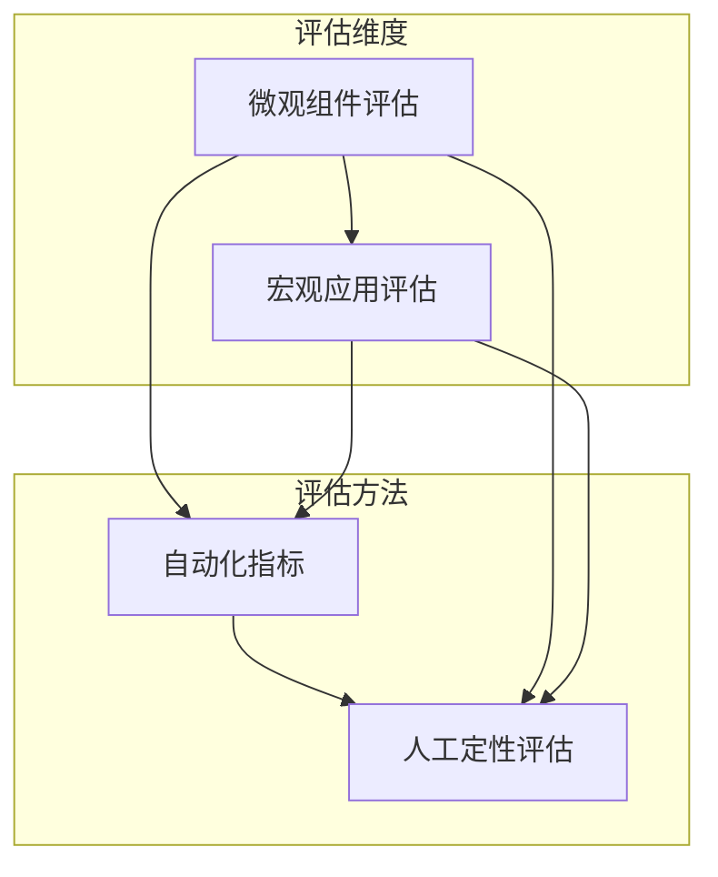

当然可以！了解不同的评估方案对于迭代和优化一个复杂的系统至关重要。除了之前提到的基于标准答案的EM和F1分数，还有很多其他维度和方法来评估KAG这类系统的效果。

我将为你介绍一个从 **“微观”** 到 **“宏观”**，从 **“自动化”** 到 **“人工”** 的评估方案全景。

### 评估方案全景图

---

### 1. 微观组件评估：深入`kg-builder`的内部

这种评估方式不关心最终的问答结果，而是聚焦于知识构建（Builder）的每一步是否做得足够好。如果源头知识就有问题，下游的问答效果肯定不会好。

#### **主要评估对象：Extractor (抽取器)**

这是最重要的评估环节。我们需要评估从文本中抽取的实体、关系、事件是否准确。

*   **评估方法：**
    1.  **人工标注黄金集**：选取一小部分（例如50-100篇）代表性的文档，由人工专家进行标注，明确哪些实体、关系应该被抽出来。这个人工标注的结果就是“黄金标准答案”（Gold Standard）。
    2.  **运行抽取器**：用你的`Extractor`处理这些文档。
    3.  **对比结果**：将抽取器的输出与人工标注的黄金集进行对比。

*   **核心指标：**
    *   **准确率 (Precision)**：在所有抽取出的三元组（主语、关系、宾语）中，有多少是正确的（即在黄金集里）？
        *   *通俗解释：评估模型是否会“幻觉”或“乱抽”不存在的知识。*
    *   **召回率 (Recall)**：在所有应该被抽取的黄金集三元组中，你的模型成功抽出了多少？
        *   *通俗解释：评估模型是否“漏掉”了重要的知识。*
    *   **F1-Score**：准确率和召回率的调和平均值，一个综合性指标。

---

### 2. 宏观应用评估：衡量`kg-solver`的端到端能力

这是我们之前讨论过的，评估整个系统回答问题的能力。除了EM和F1，还有更细致的自动化评估框架，例如**RAGAs**（尽管KAG没有直接集成，但其思想非常值得借鉴）。

#### **RAGAs框架的核心思想**

RAGAs这类框架尝试用LLM来评估LLM，从不同维度给答案打分，而不仅仅是字符串匹配。

*   **核心指标：**
    *   **上下文相关性 (Context Relevance)**：系统为回答问题所检索到的上下文（知识片段），与问题本身的相关度高吗？
        *   *评估目的：判断检索模块（Retriever）是否有效。*
    *   **答案忠实度 (Answer Faithfulness)**：最终生成的答案，是否完全基于给定的上下文？有没有脱离上下文进行“自由发挥”或“幻觉”？
        *   *评估目的：衡量生成器（Generator）的可靠性，防止胡说八道。*
    *   **答案相关性 (Answer Relevance)**：最终生成的答案，是否直接、清晰地回答了用户的问题？
        *   *评估目的：衡量答案是否切题，解决了用户的疑问。*

---

### 3. 人工定性评估：发现自动化指标的盲点

自动化指标很高效，但有时会误判。比如，一个答案可能F1分数很高，但逻辑上是错误的。因此，人工评估是不可或缺的。

*   **评估方法：**
    1.  **错误案例分析 (Error Analysis)**：
        *   随机抽取一批回答错误的Case。
        *   人工深入分析，追溯整个处理链路：是问题理解错了？还是检索的知识不准？还是知识正确但LLM推理错了？
        *   这是**定位系统瓶颈最有效**的方法。
    2.  **盲审打分 (Blind Scoring)**：
        *   邀请多位评估员，在不知道哪个答案是哪个模型版本生成的情况下，对答案进行打分。
        *   **打分维度**：
            *   **准确性** (Correctness): 答案在事实上是否正确？ (1-5分)
            *   **完整性** (Completeness): 是否全面地回答了问题？ (1-5分)
            *   **流畅度** (Fluency): 语言是否自然易读？ (1-3分)
    3.  **A/B测试 (A/B Testing)**：
        *   当你对系统做出一个改动（比如换了一个Prompt或模型）后，将新旧两个版本的系统同时在线上运行。
        *   随机将用户分配给不同版本，收集用户对答案的“点赞/点踩”等隐式反馈，或者直接让用户选择哪个答案更好。
        *   这是**衡量用户真实体验最可靠**的方法。

### 📋 **各类评估方案对比总结**

| 评估方案 | 评估对象 | 核心指标 | 优点 | 缺点 |
| :--- | :--- | :--- | :--- | :--- |
| **组件评估** (实体/关系抽取) | Extractor | Precision, Recall, F1 | **定位精准**，能找到知识构建的短板 | 需要**人工标注**黄金集，成本高 |
| **端到端问答评估** | Solver | EM, F1 | **全自动化**，快速迭代，衡量综合能力 | 过于死板，无法评估答案的逻辑和质量 |
| **RAGAs类评估** | Solver | Context Relevance, Faithfulness | **维度丰富**，能评估答案质量和来源可靠性 | 依赖LLM作为裁判，本身可能引入不确定性 |
| **人工定性评估** | 整个系统 | 错误分析, 人工打分 | **准确可靠**，能发现自动化指标的盲区 | **成本高、速度慢**，难以大规模推广 |

### 🤔 **给你的实践建议**

你应该组合使用这些方法，形成一个评估矩阵：

1.  **快速迭代期**：主要使用 **端到端问答评估 (EM/F1)**，因为它可以全自动化，每次代码提交后都能跑一遍，快速看到效果变化。
2.  **遇到瓶颈期**：当EM/F1指标上不去时，启动 **人工定性评估**，进行细致的错误案例分析，找到系统的主要矛盾。
3.  **专项优化期**：如果发现问题出在知识抽取上，就进行 **组件评估**，标注少量数据，迭代优化Extractor，直到Precision/Recall达标。
4.  **上线前/后**：使用 **A/B测试** 或 **盲审打分** 来验证你的改动是否真正提升了用户体验。

希望这个全面的介绍能帮助你更好地理解如何评估KAG系统！