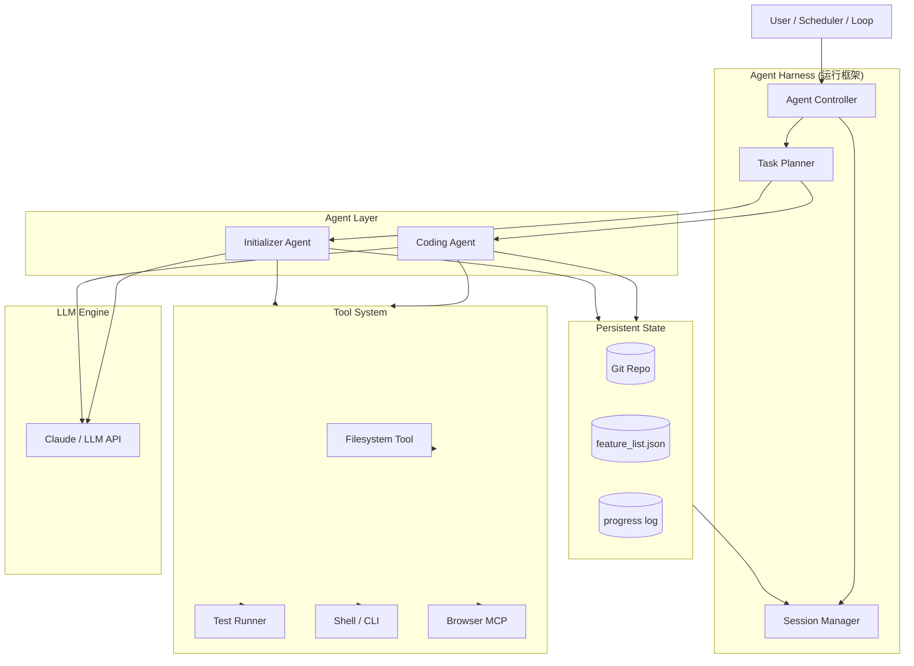
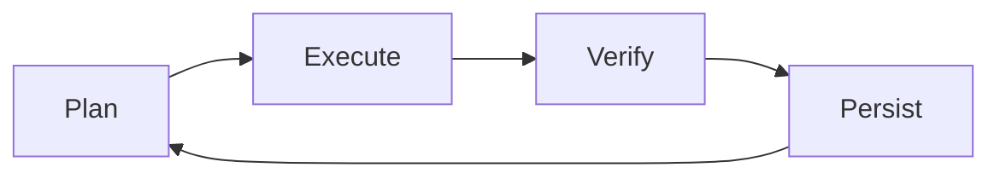

```mermaid
flowchart TB

    User[User / Scheduler / Loop]

    subgraph Harness["Agent Harness (运行框架)"]
        Controller[Agent Controller]
        Planner[Task Planner]
        Session[Session Manager]
    end

    subgraph Agents["Agent Layer"]
        InitAgent[Initializer Agent]
        CodingAgent[Coding Agent]
    end

    subgraph Memory["Persistent State"]
        Git[(Git Repo)]
        FeatureList[(feature_list.json)]
        Progress[(progress log)]
    end

    subgraph Tools["Tool System"]
        FS[Filesystem Tool]
        Test[Test Runner]
        Shell[Shell / CLI]
        Browser[Browser MCP]
    end

    subgraph LLM["LLM Engine"]
        Model[Claude / LLM API]
    end


    User --> Controller

    Controller --> Planner
    Controller --> Session

    Planner --> InitAgent
    Planner --> CodingAgent

    InitAgent --> Model
    CodingAgent --> Model

    CodingAgent --> Tools
    InitAgent --> Tools

    Tools --> FS
    Tools --> Test
    Tools --> Shell
    Tools --> Browser

    CodingAgent --> Memory
    InitAgent --> Memory

    Memory --> Session

```

```mermaid
flowchart LR

Plan --> Execute

Execute --> Verify

Verify --> Persist

Persist --> Plan
```