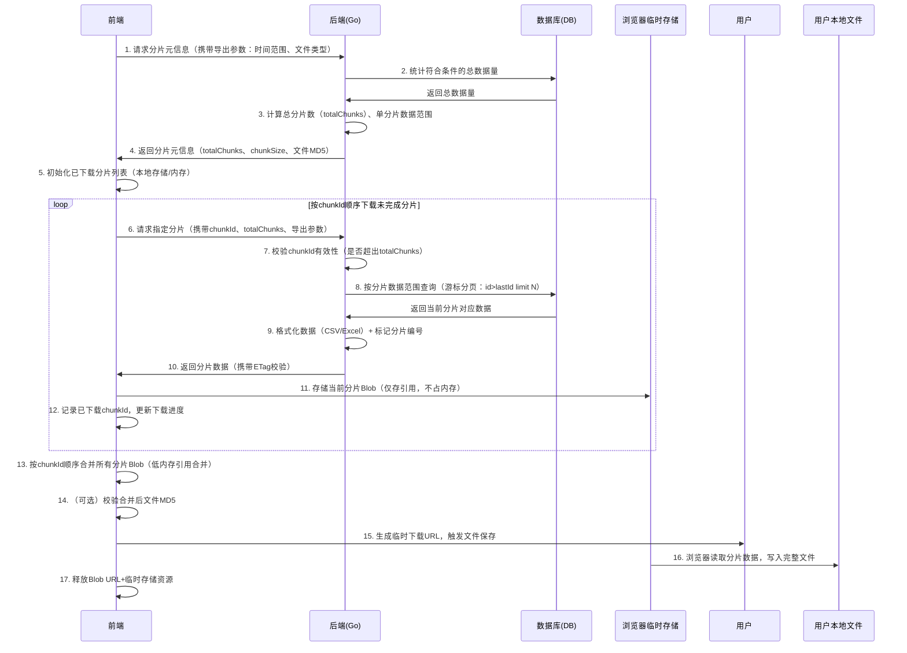

# 大文件分片下载：关键要点 + 网络流程图 + 前后端交互代码

  

## 一、核心关键要点（清晰汇总）


### 1. 核心原理与内存控制

* 低内存核心：前端逐片下载，仅缓存当前分片（内存占用 = 单分片大小），浏览器自动将大分片存入**不可见临时磁盘存储**，避免内存溢出；

  

* 合并机制：通过 `Blob 引用合并`，完整 Blob 不复制数据，仅持有分片引用，合并时内存占用可忽略；

  

* 适用场景：1GB+ 大文件导出（CSV/Excel/ 压缩包等），需避免一次性加载全量数据。

  

### 2. 分片设计规范

  
  
  

* 分片大小：建议 50-100MB（平衡网络请求数与单分片内存占用，过小则请求频繁，过大则单分片内存压力大）；

  

* 分片标识：采用「分片编号（chunkId）+ 总分片数（totalChunks）」，确保顺序唯一；

  

* 数据一致性：后端通过「游标分页 + 分片偏移」确保数据不重复、不缺失（推荐 `id > lastId` 游标，优于 `limit+offset`）；

  

* 断点续传基础：前端记录已下载分片 ID，重试时跳过已下载分片（基于本地存储或内存缓存）。

  

### 3. 前后端关键配置

  
  
  

| 角色 | 关键配置 / 操作 | 目的 |

| -- | -------------------------------- | --------------- |

| 后端 | 响应头 `Content-Type` 匹配文件类型 | 确保前端正确解析分片 |

| 后端 | 响应头 `ETag/Last-Modified` | 支持分片校验，避免重复下载 |

| 后端 | 限制单用户并发分片数（1-3 个） | 防止数据库 / 服务器压力过载 |

| 前端 | `fetch` 配置 `cache: 'no-store'` | 禁用缓存，避免分片数据过期 |

| 前端 | 逐片下载 + 即时释放响应资源 | 控制内存占用，避免泄漏 |

| 前端 | Blob 数组合并 +`URL.revokeObjectURL` | 低内存合并，释放临时资源 |

  

### 4. 异常处理要点

  
  
  

* 分片下载失败：支持重试机制（最多 3 次），重试前校验分片有效性；

  

* 客户端断开：后端通过 `Context` 监听连接状态，终止无效数据查询；

  

* 分片顺序错误：前端严格按 `chunkId` 顺序合并，后端返回分片时携带编号校验；

  

* 文件完整性：可选 MD5 校验（后端返回总文件 MD5，前端合并后校验）。

  

### 5. 优化建议

  
  
  

* 分片预先生成：超大文件（10GB+）可后端异步预先生成分片，前端直接下载，减少实时查询压力；

  

* 分片大小动态调整：根据用户网络带宽自适应调整分片大小（如弱网环境调小分片）；

  

* 并发下载控制：前端同时下载 1-3 个分片（避免并发过高导致网络阻塞）；

  

* 进度可视化：基于已下载分片数 / 总分片数，实时显示下载进度。

  

## 二、网络交互流程图

  
  
  



  

## 三、前后端交互代码（可直接运行）

  

### 1. 后端代码（Go
  

核心功能：提供「分片元信息查询」「分片数据下载」两个接口，基于游标分页优化数据库查询，支持分片校验。

  

#### 依赖准备

  
  

```

go get github.com/go-sql-driver/mysql

  

go get github.com/cespare/xxhash/v2 # 轻量哈希库，用于生成分片ETag

```

  

#### 完整代码
  
```go
package main

import (
	"context"
	"database/sql"
	"encoding/csv"
	"fmt"
	"net/http"
	"strconv"
	"time"

	"github.com/cespare/xxhash/v2"
	_ "github.com/go-sql-driver/mysql"
)

// 配置常量（根据实际场景调整）
const (
	dbDSN        = "root:123456@tcp(127.0.0.1:3306)/test_db?parseTime=true"
	chunkDataSize = 10000 // 每个分片对应的数据行数（间接控制分片大小，1万行CSV≈1MB）
	maxRetries    = 3     // 分片下载最大重试次数
)

// 订单数据模型
type Order struct {
	ID       int64     `db:"id"`
	UserID   int64     `db:"user_id"`
	Amount   float64   `db:"amount"`
	CreateAt time.Time `db:"create_at"`
	Status   string    `db:"status"`
}

// 分片元信息响应
type ChunkMetaResponse struct {
	TotalChunks int    `json:"total_chunks"` // 总分片数
	ChunkSize   int    `json:"chunk_data_size"` // 每个分片数据行数
	FileMD5     string `json:"file_md5"` // 总文件哈希（用于完整性校验）
	FileName    string `json:"file_name"` // 最终文件名
}

func main() {
	// 初始化数据库连接
	db, err := sql.Open("mysql", dbDSN)
	if err != nil {
		panic(fmt.Sprintf("数据库连接失败：%v", err))
	}
	defer db.Close()

	// 注册核心接口
	http.HandleFunc("/api/export/orders/chunk-meta", func(w http.ResponseWriter, r *http.Request) {
		getChunkMeta(w, r, db)
	})
	http.HandleFunc("/api/export/orders/chunk", func(w http.ResponseWriter, r *http.Request) {
		downloadChunk(w, r, db)
	})

	// 启动服务
	fmt.Println("服务启动：http://localhost:8080")
	panic(http.ListenAndServe(":8080", nil))
}

// 接口1：获取分片元信息（前端先调用，获取总分片数等）
func getChunkMeta(w http.ResponseWriter, r *http.Request, db *sql.DB) {
	// 1. 解析请求参数
	startTime := r.URL.Query().Get("start_time")
	endTime := r.URL.Query().Get("end_time")
	if startTime == "" || endTime == "" {
		http.Error(w, "缺少时间范围参数", http.StatusBadRequest)
		return
	}

	// 2. 查询符合条件的总数据量
	var totalCount int64
	countSQL := `SELECT COUNT(1) FROM orders WHERE create_at BETWEEN ? AND ?`
	err := db.QueryRowContext(context.Background(), countSQL, startTime, endTime).Scan(&totalCount)
	if err != nil {
		http.Error(w, fmt.Sprintf("查询总数据量失败：%v", err), http.StatusInternalServerError)
		return
	}

	// 3. 计算总分片数（向上取整）
	totalChunks := int((totalCount + int64(chunkDataSize) - 1) / int64(chunkDataSize))
	if totalChunks == 0 {
		http.Error(w, "无符合条件的数据", http.StatusNoContent)
		return
	}

	// 4. 生成总文件哈希（基于查询条件+总数据量，用于完整性校验）
	hash := xxhash.New()
	hash.Write([]byte(fmt.Sprintf("%s_%s_%d", startTime, endTime, totalCount)))
	fileMD5 := fmt.Sprintf("%x", hash.Sum(nil))

	// 5. 构造响应
	fileName := fmt.Sprintf("orders_%s.csv", time.Now().Format("20060102150405"))
	resp := ChunkMetaResponse{
		TotalChunks: totalChunks,
		ChunkSize:   chunkDataSize,
		FileMD5:     fileMD5,
		FileName:    fileName,
	}

	// 6. 返回JSON响应
	w.Header().Set("Content-Type", "application/json; charset=utf-8")
	w.WriteHeader(http.StatusOK)
	fmt.Fprintf(w, `{"total_chunks":%d,"chunk_data_size":%d,"file_md5":"%s","file_name":"%s"}`,
		resp.TotalChunks, resp.ChunkSize, resp.FileMD5, resp.FileName)
}

// 接口2：下载指定分片数据
func downloadChunk(w http.ResponseWriter, r *http.Request, db *sql.DB) {
	// 1. 解析请求参数
	startTime := r.URL.Query().Get("start_time")
	endTime := r.URL.Query().Get("end_time")
	chunkIdStr := r.URL.Query().Get("chunk_id")
	fileMD5 := r.URL.Query().Get("file_md5")
	if startTime == "" || endTime == "" || chunkIdStr == "" || fileMD5 == "" {
		http.Error(w, "缺少必要参数（start_time/end_time/chunk_id/file_md5）", http.StatusBadRequest)
		return
	}

	// 2. 校验分片编号
	chunkId, err := strconv.Atoi(chunkIdStr)
	if err != nil || chunkId < 1 {
		http.Error(w, "分片编号格式错误（需为正整数）", http.StatusBadRequest)
		return
	}

	// 3. 校验文件MD5（防止非法分片请求）
	hash := xxhash.New()
	hash.Write([]byte(fmt.Sprintf("%s_%s_%d", startTime, endTime, getTotalCount(db, startTime, endTime))))
	validMD5 := fmt.Sprintf("%x", hash.Sum(nil))
	if fileMD5 != validMD5 {
		http.Error(w, "文件MD5校验失败，非法请求", http.StatusForbidden)
		return
	}

	// 4. 计算当前分片的游标范围（基于ID游标，优化查询）
	// 4.1 获取当前分片的起始ID（前一个分片的最后ID）
	lastId := getLastIdByChunkId(db, startTime, endTime, chunkId, chunkDataSize)
	// 4.2 查询当前分片数据（id > lastId，限制行数）
	orders, err := queryOrdersByCursor(db, startTime, endTime, lastId, chunkDataSize)
	if err != nil {
		http.Error(w, fmt.Sprintf("查询分片数据失败：%v", err), http.StatusInternalServerError)
		return
	}

	// 5. 设置响应头（支持分片校验+正确解析）
	w.Header().Set("Content-Type", "text/csv; charset=utf-8")
	w.Header().Set("Cache-Control", "no-store")
	// 生成分片ETag（用于前端校验分片完整性）
	chunkHash := xxhash.New()
	chunkHash.Write([]byte(fmt.Sprintf("%d_%s", chunkId, validMD5)))
	w.Header().Set("ETag", fmt.Sprintf(`"%x"`, chunkHash.Sum(nil)))

	// 6. 格式化CSV并写入响应
	csvWriter := csv.NewWriter(w)
	// 仅第一分片写入表头（避免合并后重复表头）
	if chunkId == 1 {
		header := []string{"订单ID", "用户ID", "金额", "创建时间", "状态"}
		if err := csvWriter.Write(header); err != nil {
			http.Error(w, fmt.Sprintf("写入表头失败：%v", err), http.StatusInternalServerError)
			return
		}
	}

	// 写入分片数据
	for _, order := range orders {
		record := []string{
			strconv.FormatInt(order.ID, 10),
			strconv.FormatInt(order.UserID, 10),
			fmt.Sprintf("%.2f", order.Amount),
			order.CreateAt.Format("2006-01-02 15:04:05"),
			order.Status,
		}
		if err := csvWriter.Write(record); err != nil {
			fmt.Printf("写入分片数据失败：%v\n", err)
			return
		}
	}

	// 刷新响应，确保数据发送
	csvWriter.Flush()
	if err := csvWriter.Error(); err != nil {
		fmt.Printf("分片数据刷新失败：%v\n", err)
		return
	}

	// 7. 监听客户端断开，终止后续操作
	select {
	case <-r.Context().Done():
		fmt.Printf("客户端断开连接，终止分片%d传输\n", chunkId)
	default:
		fmt.Printf("分片%d传输完成\n", chunkId)
	}
}

// 辅助函数：查询符合条件的总数据量
func getTotalCount(db *sql.DB, startTime, endTime string) int64 {
	var total int64
	db.QueryRowContext(context.Background(),
		`SELECT COUNT(1) FROM orders WHERE create_at BETWEEN ? AND ?`,
		startTime, endTime).Scan(&total)
	return total
}

// 辅助函数：根据分片编号获取当前分片的起始游标（lastId）
func getLastIdByChunkId(db *sql.DB, startTime, endTime string, chunkId, chunkSize int) int64 {
	// 第1分片：lastId=0（从第一条数据开始）
	if chunkId == 1 {
		return 0
	}
	// 非第1分片：查询前一个分片的最后一条ID
	offset := (chunkId - 2) * chunkSize // 前一个分片的偏移量
	var lastId int64
	querySQL := `SELECT id FROM orders WHERE create_at BETWEEN ? AND ? ORDER BY id LIMIT ? OFFSET ?`
	err := db.QueryRowContext(context.Background(), querySQL, startTime, endTime, 1, offset+chunkSize-1).Scan(&lastId)
	if err != nil {
		return 0
	}
	return lastId
}

// 辅助函数：基于游标分页查询订单数据（高效，无全表扫描）
func queryOrdersByCursor(db *sql.DB, startTime, endTime string, lastId int64, limit int) ([]Order, error) {
	querySQL := `SELECT id, user_id, amount, create_at, status 
	             FROM orders 
	             WHERE create_at BETWEEN ? AND ? AND id > ? 
	             ORDER BY id LIMIT ?`
	rows, err := db.QueryContext(context.Background(), querySQL, startTime, endTime, lastId, limit)
	if err != nil {
		return nil, err
	}
	defer rows.Close()

	var orders []Order
	for rows.Next() {
		var order Order
		if err := rows.Scan(&order.ID, &order.UserID, &order.Amount, &order.CreateAt, &order.Status); err != nil {
			return nil, err
		}
		orders = append(orders, order)
	}
	return orders, nil
}
```


### 2. 前端代码（JavaScript）

核心功能：请求分片元信息、逐片下载（支持断点续传 + 重试）、低内存合并、进度显示、触发下载。


```html
<!DOCTYPE html>
<html>
<head>
    <title>大文件分片下载示例</title>
    <style>
        .progress { width: 500px; height: 20px; border: 1px solid #ccc; margin: 10px 0; }
        .progress-bar { height: 100%; background: #4CAF50; width: 0%; transition: width 0.3s; }
        button { padding: 8px 16px; cursor: pointer; }
        .status { margin: 10px 0; color: #333; }
    </style>
</head>
<body>
    <h3>大文件分片下载（订单CSV）</h3>
    <button onclick="startExport()">开始导出（2024年1月订单）</button>
    <div class="status">状态：未开始</div>
    <div class="progress">
        <div class="progress-bar" id="progressBar"></div>
    </div>

    <script>
        // 全局状态：记录已下载分片、分片元信息
        let downloadedChunks = new Set(); // 已下载分片ID集合（断点续传用）
        let chunkMeta = null; // 分片元信息（总分片数、文件名等）
        const MAX_RETRY = 3; // 分片下载最大重试次数
        const EXPORT_PARAMS = {
            startTime: "2024-01-01 00:00:00",
            endTime: "2024-01-31 23:59:59"
        };

        // 开始导出流程
        async function startExport() {
            const button = document.querySelector('button');
            const statusElem = document.querySelector('.status');
            const progressBar = document.getElementById('progressBar');

            // 初始化状态
            button.disabled = true;
            statusElem.textContent = "状态：获取分片信息中...";
            downloadedChunks.clear();
            progressBar.style.width = "0%";

            try {
                // 步骤1：获取分片元信息
                chunkMeta = await getChunkMeta();
                statusElem.textContent = `状态：共${chunkMeta.total_chunks}个分片，开始下载...`;

                // 步骤2：逐片下载（按ID顺序）
                const blobParts = []; // 存储分片Blob引用（低内存合并）
                for (let chunkId = 1; chunkId <= chunkMeta.total_chunks; chunkId++) {
                    // 跳过已下载分片（断点续传）
                    if (downloadedChunks.has(chunkId)) {
                        updateProgress(chunkId, chunkMeta.total_chunks);
                        continue;
                    }

                    // 下载当前分片（支持重试）
                    const chunkBlob = await downloadChunkWithRetry(chunkId, MAX_RETRY);
                    blobParts.push(chunkBlob);
                    downloadedChunks.add(chunkId);

                    // 更新进度
                    updateProgress(chunkId, chunkMeta.total_chunks);
                    statusElem.textContent = `状态：下载中 ${chunkId}/${chunkMeta.total_chunks}`;
                }

                // 步骤3：合并分片并触发下载
                statusElem.textContent = "状态：合并分片并准备下载...";
                await mergeAndDownload(blobParts);

                statusElem.textContent = "状态：导出成功！";
            } catch (error) {
                statusElem.textContent = `状态：导出失败：${error.message}`;
                console.error("导出异常：", error);
            } finally {
                // 重置状态（1秒后解锁按钮）
                setTimeout(() => {
                    button.disabled = false;
                    downloadedChunks.clear();
                    chunkMeta = null;
                }, 1000);
            }
        }

        // 步骤1：请求分片元信息
        async function getChunkMeta() {
            const url = new URL("http://localhost:8080/api/export/orders/chunk-meta");
            url.searchParams.append("start_time", EXPORT_PARAMS.startTime);
            url.searchParams.append("end_time", EXPORT_PARAMS.endTime);

            const response = await fetch(url, {
                method: 'GET',
                cache: 'no-store'
            });

            if (!response.ok) {
                throw new Error(`获取分片信息失败：${response.statusText}`);
            }

            return response.json();
        }

        // 步骤2：下载单个分片（带重试机制）
        async function downloadChunkWithRetry(chunkId, retryCount) {
            try {
                const url = new URL("http://localhost:8080/api/export/orders/chunk");
                url.searchParams.append("start_time", EXPORT_PARAMS.startTime);
                url.searchParams.append("end_time", EXPORT_PARAMS.endTime);
                url.searchParams.append("chunk_id", chunkId);
                url.searchParams.append("file_md5", chunkMeta.file_md5);

                const response = await fetch(url, {
                    method: 'GET',
                    cache: 'no-store',
                    headers: {
                        'Accept': 'text/csv'
                    }
                });

                if (!response.ok) {
                    throw new Error(`分片${chunkId}下载失败（状态码：${response.status}）`);
                }

                // 校验分片ETag（可选，确保数据完整性）
                const etag = response.headers.get('ETag');
                if (!etag) {
                    console.warn(`分片${chunkId}缺少ETag，跳过校验`);
                }

                // 转为Blob并返回（存储到浏览器临时存储）
                const blob = await response.blob();
                // 释放响应资源
                response.body?.cancel();
                return blob;
            } catch (error) {
                if (retryCount > 0) {
                    console.log(`分片${chunkId}下载失败，剩余重试次数：${retryCount}，正在重试...`);
                    return downloadChunkWithRetry(chunkId, retryCount - 1);
                }
                throw new Error(`分片${chunkId}下载失败（已重试${MAX_RETRY}次）：${error.message}`);
            }
        }

        // 步骤3：合并分片并触发下载
        async function mergeAndDownload(blobParts) {
            // 低内存合并：仅合并Blob引用，不复制数据
            const completeBlob = new Blob(blobParts, {
                type: 'text/csv; charset=utf-8'
            });

            // 生成临时下载URL
            const downloadUrl = URL.createObjectURL(completeBlob);

            // 创建下载链接并触发点击
            const a = document.createElement('a');
            a.href = downloadUrl;
            a.download = chunkMeta.file_name;
            document.body.appendChild(a);
            a.click();

            // 释放资源（避免内存泄漏）
            setTimeout(() => {
                document.body.removeChild(a);
                URL.revokeObjectURL(downloadUrl);
                blobParts.length = 0; // 清空Blob引用，触发垃圾回收
            }, 1000);
        }

        // 辅助函数：更新下载进度
        function updateProgress(current, total) {
            const progress = (current / total) * 100;
            document.getElementById('progressBar').style.width = `${progress}%`;
        }
    </script>
</body>
</html>
```


  

## 四、使用说明

  
  
  

1. 环境准备：

  

* 后端：安装 Go 1.18+，配置 MySQL 数据库（创建`orders`表并插入测试数据）；

  

* 前端：直接打开 HTML 文件（需允许跨域，或后端配置 CORS）。

  

1. 核心交互流程：

  

* 前端点击「开始导出」→ 先请求`chunk-meta`接口获取总分片数；

  

* 前端按顺序下载每个分片（支持重试 + 断点续传）；

  

* 所有分片下载完成后，低内存合并为完整 Blob，触发下载。

  

1. 扩展建议：

  

* 断点续传持久化：将`downloadedChunks`存储到`localStorage`，刷新页面后仍可恢复下载；

  

* 并发下载：使用`Promise.all`控制 1-3 个并发分片下载，提升速度；

  

* 大文件校验：合并后通过`spark-md5`库计算文件 MD5，与后端返回的`fileMD5`对比，确保完整性。

  

> （注：文档部分内容可能由 AI 生成）