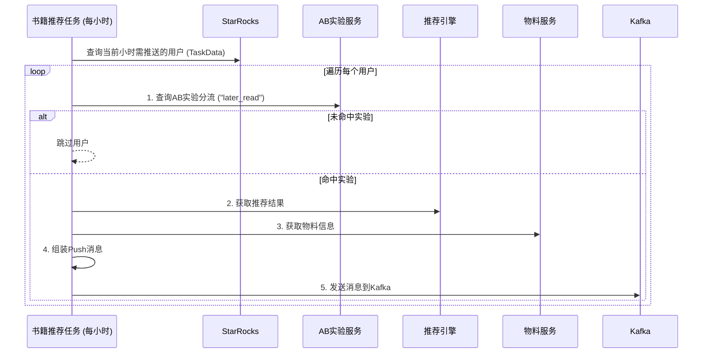

![[IMG-20250711184452765.png]]

可以看到加了括号，确定优先级就没有输出了

# 技术文档：阅读后期推荐书籍任务性能优化

  

## 1. 需求背景

  

当前“阅读后期推荐书籍”任务在业务高峰期（尤其是 23:00）对推荐引擎发起大量实时请求，导致：

- **成本高昂**：高峰期的集中请求产生了显著的计算成本，预估每月 `1w`。

- **稳定性风险**：实时同步调用下游服务（推荐、AB实验），增加了任务延迟和不确定性，任何服务抖动都可能影响用户触达。

  

为解决上述问题，我们提出本次优化方案，旨在通过**请求时机迁移**和**任务异步化**，实现降本增效和系统稳定性提升。

  

## 2. 总体设计

  

### 2.1 现有流程

  



  

### 2.2 优化后流程

  

优化后的流程将拆分为两个独立的任务：**推荐预热任务** 和 **书籍推荐任务**。

  

```mermaid

graph TD

subgraph "任务一: 推荐预热任务 (每日 00:01)"

A[开始] --> B{查询全量目标用户<br>(完结/追更)};

B --> C{遍历用户};

C --> D[并发请求<br>AB实验 & 推荐引擎];

D --> E{获取推荐结果};

E --> F[将结果写入 Redis<br>Key: rec:later_read:{source_uid}<br>Value: {rec_data...}<br>TTL: 24h];

F --> C;

C -- 完成 --> G[结束];

end

  

subgraph "任务二: 书籍推荐任务 (每小时)"

H[开始] --> I{查询当前小时需推送的用户};

I --> J{遍历用户};

J --> K[从 Redis 读取预热数据];

K -- 命中 --> L[获取物料信息];

L --> M[组装Push消息];

M --> N[发送消息到Kafka];

N --> J;

K -- 未命中 --> O[记录日志并告警];

O --> J;

J -- 完成 --> P[结束];

end

```

  

## 3. 模块设计

  

### 3.1 新建：推荐预热任务 (`pre-warming-rec-book`)

  

这是一个新的 Go Job，负责在业务低峰期（每日零点）执行核心的计算和数据准备工作。

  

- **触发方式**：定时任务，每日 `00:01` 自动触发。

- **核心逻辑**：

1. **定义一个新的 `task_id`**: `pre-warming-rec-book`，用于标识此预热任务。

2. **获取用户**：从 `task_data` 表中查询 `task_id` 为 `04-026-DATE-r0gdua` (完结) 和 `04-026-DATE-qk79ub` (追更) 的 **全天** 用户列表。

3. **并发处理**：使用协程池（`ants` 等）对用户列表进行并发处理，控制并发量，避免对下游服务造成冲击。

4. **调用下游**：对于每个用户，依次调用 `AB实验服务` 和 `推荐引擎`。

5. **写入缓存**：将获取到的推荐结果（包含 `trace_id`）序列化后存入 Redis。

- **伪代码实现**:

```go

func preWarmingTask() {

// 1. 获取全量用户

targetUsers := queryUsersFromStarRocks("04-026-DATE-r0gdua", "04-026-DATE-qk79ub")

  

// 2. 初始化协程池

pool, _ := ants.NewPool(50) // 并发数为 50

defer pool.Release()

  

var wg sync.WaitGroup

for _, user := range targetUsers {

wg.Add(1)

_ = pool.Submit(func() {

defer wg.Done()

// 3. 获取AB实验信息

abValue, traceID, _ := getABInfo(user.SourceUID, user.Project, "later_read", "0")

if abValue == "0" { // 未命中实验

return

}

  

// 4. 获取推荐结果

recResult := recWorker.GetRec(user, "pre-warming-process", traceID)

if recResult == nil {

log.Printf("Failed to get recommendation for user: %s", user.SourceUID)

return

}

  

// 5. 存入 Redis

redisKey := fmt.Sprintf("rec:later_read:%s", user.SourceUID)

redisValue := CachedRecData{

RecID: recResult.RecID,

RecType: recResult.RecType,

MaterialID: recResult.MaterialID,

TraceID: traceID,

}

// 使用 JSON 序列化

jsonData, _ := json.Marshal(redisValue)

redisClient.Set(context.Background(), redisKey, jsonData, 24*time.Hour)

})

}

wg.Wait()

}

```

  

### 3.2 改造：书籍推荐任务 (`BookRecommendHandler`)

  

改造现有的 `BookRecommendHandler`，使其从数据源查询转为从缓存查询。

  

- **触发方式**：保持不变，按小时触发。

- **核心逻辑改造点 (`handleSingleUser`)**：

1. **移除旧逻辑**：删除对 `getABInfo` 和 `recWorker.GetRec` 的调用。

2. **增加缓存读取**：根据 `user.SourceUID` 从 Redis 中读取预热数据。

3. **处理缓存未命中**：如果 Redis 中数据不存在 (Cache Miss)，**跳过该用户，并记录一条告警日志**。

4. **使用缓存数据**：如果缓存命中，反序列化数据，并将 `trace_id`, `RecID`, `RecType`, `MaterialID` 等信息传递给后续的 `materialWorker.GetMaterial` 和 `genMsg` 流程。

- **伪代码实现**:

```go

func (h *BookRecommendHandler) handleSingleUser(data interface{}) {

v := data.(*business.TaskData)

  

// 1. 从 Redis 获取预热的推荐数据

redisKey := fmt.Sprintf("rec:later_read:%s", v.SourceUID)

jsonData, err := redisClient.Get(context.Background(), redisKey).Result()

  

// 2. 处理缓存未命中

if err != nil { // 包括 redis.Nil 的情况

log.Printf("Cache miss or error for user: %s, error: %v", v.SourceUID, err)

// TODO: 此处增加告警逻辑

return

}

  

// 3. 反序列化缓存数据

var cachedData CachedRecData

_ = json.Unmarshal([]byte(jsonData), &cachedData)

  

// 4. 继续后续流程，使用缓存数据

r := &rec_service.RecResult{ // 伪造一个 RecResult 对象

RecID: cachedData.RecID,

RecType: cachedData.RecType,

MaterialID: cachedData.MaterialID,

}

  

m := h.materialWorker.GetMaterial(v.SourceUID, r.RecID, r.RecType, r.MaterialID)

if m == nil {

return

}

  

msg := h.genMsg(v, m, cachedData.TraceID) // 使用缓存中的 traceID

if msg == nil {

return

}

  

// ... 发送到 Kafka 逻辑不变

}

```

  

## 4. 数据模型

  

### Redis 缓存数据结构

  

- **Key**: `rec:later_read:{source_uid}`

- **Type**: `String` (存储 JSON)

- **Value (JSON Object)**:

```json

{

"rec_id": "string",

"rec_type": "string",

"material_id": "string",

"trace_id": "string"

}

```

- **TTL**: 24 hours

  

## 5. 关键技术选型

  

- **缓存数据库**：`Redis`。成熟、高性能，满足 KV 存储和 TTL 的需求。

- **并发控制**：在预热脚本中使用 `ants` 协程池，可以有效控制并发量，保护下游服务。

- **序列化**：使用标准库 `encoding/json`。考虑到数据结构简单，`sonic` 库带来的性能提升可能不是瓶颈，但可以作为备选。

- **监控告警**：对于缓存未命中的情况，通过记录日志并配置关键字告警，来及时发现预热任务的异常。

  

## 6. 风险评估

  

1. **Redis 单点故障**：

- **风险**：如果 Redis 集群不可用，会导致所有书籍推荐任务失败。

- **应对**：确保 Redis 部署在高可用模式（主从/哨兵/集群）。在 `BookRecommendHandler` 中增加对 Redis 连接错误的异常处理和告警。

2. **预热任务失败**：

- **风险**：如果预热任务失败或未完成，会导致第二天的推荐数据为空。

- **应对**：为预热任务增加重试机制和失败告警，确保运维人员能第一时间介入。

3. **数据不一致**：

- **风险**：预热数据是在零点生成的，用户的某些状态（如 AB 分组）在当天可能发生变化，导致数据不一致。

- **应对**：根据业务判断，"later_read" 实验的分组在一天内变动的概率极低，此风险可以接受。

4. **StarRocks 压力**：

- **风险**：预热任务在零点一次性拉取全量用户，可能对 StarRocks 造成瞬时压力。

- **应对**：与数据平台/DBA 确认该时间窗口的查询影响。如果存在风险，可以考虑将查询分批进行。

  

---

*文档版本: 1.0 (初稿)*

*最后更新: {{CURRENT_DATE}}*